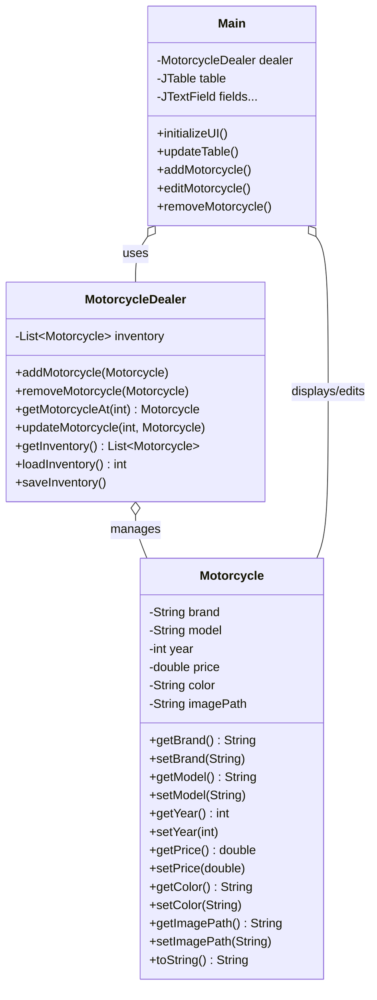

# Relatório de Projeto: Motorcycle Dealer Stand - Explorando a Programação Orientada a Objetos
## 1. Introdução

Este relatório descreve o desenvolvimento do **Motorcycle Dealer Stand**, uma aplicação Java Swing para gestão de inventário de uma concessionária de motocicletas. O objetivo principal deste projeto é aplicar e demonstrar os princípios fundamentais da Programação Orientada a Objetos (POO), incluindo **Encapsulamento**, **Abstração**, **Herança** (embora limitada neste projeto simples) e **Polimorfismo**. A aplicação serve como uma ferramenta prática para estudantes de programação, permitindo-lhes visualizar como conceitos de POO se traduzem em uma interface gráfica funcional para gestão de dados.

## 2. Análise de Contexto

No ensino da engenharia de software, conceitos como encapsulamento e abstração são essenciais para criar aplicações robustas e manuteníveis. O contexto deste trabalho advém da necessidade de criar um artefacto pedagógico que materialize esses conceitos em um domínio prático: a gestão de inventário de veículos. O Motorcycle Dealer Stand foi concebido para ser simples, utilizando Java Swing para criar uma interface intuitiva, proporcionando código legível e bem estruturado.

## 3. Requisitos

### Requisitos Funcionais
- O sistema deve permitir adicionar novas motocicletas ao inventário através de um formulário.
- O sistema deve permitir editar motocicletas selecionadas na tabela.
- O sistema deve permitir visualizar todas as motocicletas em uma tabela com funcionalidade de busca.
- O sistema deve permitir remover motocicletas selecionadas.
- O sistema deve suportar anexar e visualizar imagens das motocicletas.
- O sistema deve persistir os dados automaticamente em um arquivo CSV.
- O sistema deve exibir estatísticas do inventário (contagem, preço médio, ano mais recente).

### Requisitos Não-Funcionais
- O projeto deve aplicar princípios de POO (Encapsulamento, Abstração).
- O software deve ser compilável na versão base do Java (JDK 8 ou superior).
- O projeto deve focar na legibilidade do código-fonte e estar documentado.
- A interface deve ser intuitiva e responsiva, com tratamento de erros.

## 4. Diagramas de Casos de Uso

Para o desenho de diagramas de uma forma integrada ao código, utilizamos o formato **Mermaid**. Abaixo está a representação gráfica das ações possíveis pelo usuário:

```mermaid
usecaseDiagram
    actor Usuário
    usecase "Adicionar Motocicleta" as UC1
    usecase "Editar Motocicleta" as UC2
    usecase "Visualizar Inventário" as UC3
    usecase "Remover Motocicleta" as UC4
    usecase "Buscar Motocicletas" as UC5
    usecase "Visualizar Estatísticas" as UC6

    Usuário --> UC1
    Usuário --> UC2
    Usuário --> UC3
    Usuário --> UC4
    Usuário --> UC5
    Usuário --> UC6
```

## 5. User Stories

1. **Como** usuário/concessionário, **quero** adicionar novas motocicletas ao inventário **para** expandir o catálogo disponível.
2. **Como** usuário, **quero** editar informações de motocicletas existentes **para** manter os dados atualizados.
3. **Como** usuário, **quero** visualizar todas as motocicletas em uma tabela **para** ter uma visão geral do inventário.
4. **Como** usuário, **quero** remover motocicletas do inventário **para** limpar registros desatualizados.
5. **Como** usuário, **quero** anexar imagens às motocicletas **para** melhorar a apresentação visual.
6. **Como** estudante lendo o código-fonte, **quero** que a classe Motorcycle use encapsulamento **para** compreender como proteger dados internos.

## 6. Análise de Domínio / Modelo de Classes

A análise de domínio foca-se nas relações entre as classes principais da aplicação. O diagrama seguinte (em formato **Mermaid**) resume as relações de composição e dependência entre as classes:



## 7. Análise da Estrutura do Projeto

O código do Motorcycle Dealer Stand mapeia perfeitamente para os ensinamentos base de Programação Orientada a Objetos:

- **Abstração**: Empregada através da separação de responsabilidades: a classe `Motorcycle` representa o conceito abstrato de uma motocicleta, enquanto `MotorcycleDealer` abstrai a gestão do inventário, e `Main` abstrai a interface do usuário.
- **Encapsulamento**: Variáveis de estado críticas (como `brand`, `model`, `price` em `Motorcycle`) são privadas, acessíveis apenas através de getters e setters públicos. Isso previne modificações diretas e permite validação.
- **Herança**: Embora não extensivamente usada neste projeto simples, a estrutura permite extensão futura (por exemplo, subclasses de Motorcycle para tipos específicos).
- **Polimorfismo**: Demonstrado no método `toString()` que pode ser sobrescrito, e na manipulação genérica de objetos Motorcycle na lista do inventário.

## 8. Apresentação do Projeto Final: Descrição da Interface

A aplicação apresenta uma interface gráfica intuitiva com:
- Um painel de cabeçalho com título e estatísticas do inventário.
- Um formulário lateral para adicionar/editar motocicletas, com campos para marca, modelo, ano, preço, cor e caminho da imagem.
- Uma tabela central exibindo o inventário, com funcionalidade de busca.
- Botões para adicionar, editar e remover motocicletas.
- Uma pré-visualização de imagem para a motocicleta selecionada.
- Temas de cores carregados de um arquivo CSS para uma aparência moderna.

(Capturas de tela não estão disponíveis neste relatório, mas a interface é responsiva e segue boas práticas de UX.)

## 9. Conclusão Geral / Reflexão Final

Através da construção do projeto Motorcycle Dealer Stand, tornou-se evidente o poder dos princípios de POO na criação de aplicações desktop funcionais. A estrutura modular forneceu flexibilidade para extensibilidade futura, como adicionar novos tipos de veículos ou funcionalidades de busca avançada. A separação de responsabilidades (Modelo-Visão-Controlador implícita) reduziu a complexidade e facilitou a manutenção. O encapsulamento protegeu a integridade dos dados, enquanto a abstração permitiu uma interface clara e reutilizável. Este projeto demonstra como conceitos de POO podem ser aplicados de forma prática em aplicações do mundo real, servindo como base sólida para estudantes aprenderem e expandirem seus conhecimentos em desenvolvimento de software.</content>
<parameter name="filePath">c:\Users\afons\OneDrive\Ambiente de Trabalho\stand VScode\Relatorio_MotorcycleDealer.md